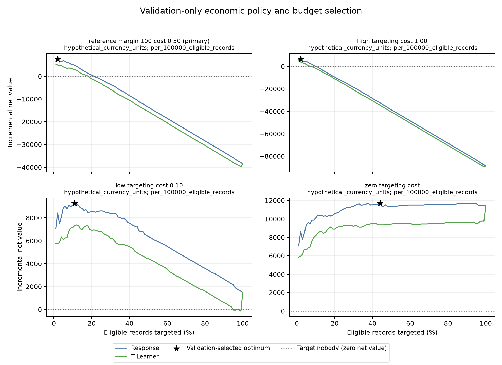
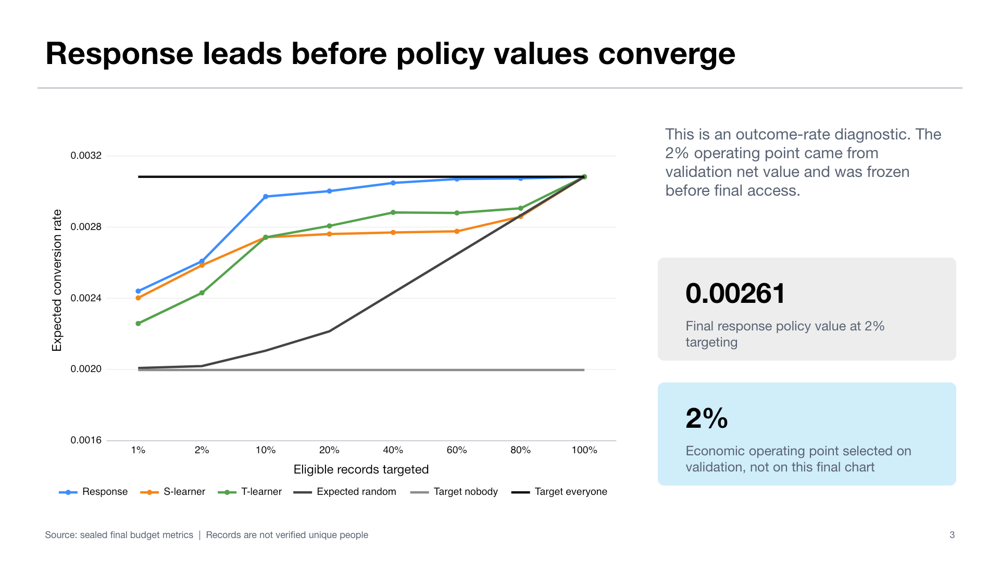
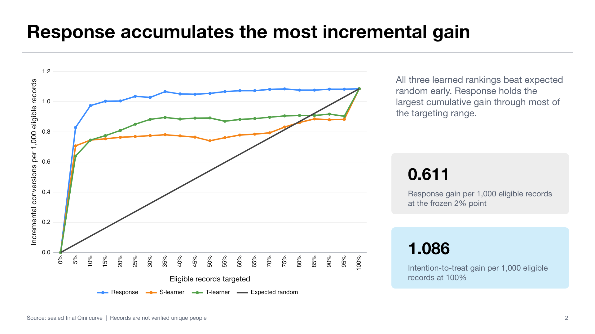

# Causal Ad Targeting: Response vs Uplift Modeling

Most ad-targeting systems predict who is likely to convert, but a high-propensity customer may have converted without seeing an ad. This project asks a more useful allocation question: with a limited targeting budget, which eligible records are most likely to produce *incremental* conversions because they receive treatment?

## Response targeting versus uplift modeling

**Response targeting** asks, “Who is most likely to convert if targeted?” It ranks records by predicted treated conversion probability. This can work well, but it may spend budget on people whose outcomes would not change.

**Uplift modeling** asks, “For whom will treatment change the outcome?” It estimates the difference between predicted conversion with and without treatment. The experiment tests whether that causal ranking improves on a strong response-model benchmark instead of assuming that a more complex uplift method must win.

## Dataset and experimental setup

The project uses the corrected, unbiased **Criteo Uplift Prediction Dataset v2.1**: 13,979,592 randomized ad-treatment records with 12 anonymized pre-treatment features and a binary conversion outcome. Eight categorical features are sparsely one-hot encoded and four continuous features are standardized.

A uniform 2,000,000-record development sample is split into 1,600,000 training and 400,000 validation records. Validation alone selects the policy and targeting share from a 1%–100% grid plus a target-nobody option. Those decisions are frozen before one evaluation on a fresh 400,000-record sample that is disjoint from development and every previously accessed final sample.

## Models and evaluation

The comparison uses three fixed SGD-logistic baselines:

- **Response model:** predicts conversion among treated records and ranks by treated response probability.
- **S-learner:** fits one outcome model with treatment and treatment-feature interactions, then scores the counterfactual difference.
- **T-learner:** fits separate treatment and control outcome models, then subtracts their predictions.

Economic selection compares response, T-learner, and target nobody; S-learner remains visible in ranking diagnostics. Policies are evaluated with empirical-marginal-propensity inverse-probability weighting, policy-value curves, AUUC, and Qini. Final uncertainty uses 1,000 conditional row-level paired-bootstrap repetitions with the fitted models, rankings, and cutoff held fixed.

## Headline result

Under the predeclared scenario of 100 hypothetical value units per incremental conversion, 0.50 per assigned target, and 100,000 eligible records, **validation selected response targeting at 2%**.

| Final estimate | Result |
|---|---:|
| Estimated incremental conversions | **61.10 per 100K eligible records** |
| Incremental net value vs target nobody | **5,109.98 hypothetical net-value units** |
| 95% interval for incremental net value | **[1,815.61, 8,171.56]** |
| Challenger decision | **T-learner did not demonstrate superiority** |

The result retains response as the benchmark champion among the evaluated fixed linear baseline models. It does not claim equivalence between models or a universal 2% optimum.

## Major plots

### Economic policy selection



*Takeaway: the primary validation scenario selects response at 2%; the sensitivity panels show that the preferred budget changes when targeting cost changes.*

### Policy-value curve



*Takeaway: response has the highest estimated policy value through most evaluated targeting shares. The frozen 2% operating point came from validation economics, not from optimizing this final-sample chart.*

### Qini curve



*Takeaway: response accumulates the largest incremental gain across most of the targeting range, while all policies meet at the common treat-everyone endpoint.*

## Setup and testing

```bash
python3 -m venv .venv
source .venv/bin/activate
python -m pip install -r requirements.txt
python -m unittest discover -s tests -v
```

The dataset is not committed; see [`data/README.md`](data/README.md) for acquisition and license details. The stack is Python, NumPy, pandas, SciPy, scikit-learn, Matplotlib, and `unittest`. The completed final evaluation is sealed and intentionally non-repeatable, so setup and tests do not require rerunning it.

For estimator details, governance, audit history, receipt verification, and extended limitations, see [`TECHNICAL.md`](TECHNICAL.md). Machine-readable conclusions are in [`reports/metrics/result_card.json`](reports/metrics/result_card.json).

## Scope

Economics are hypothetical and all results are offline; they are not observed advertiser profit or production-deployment evidence.
